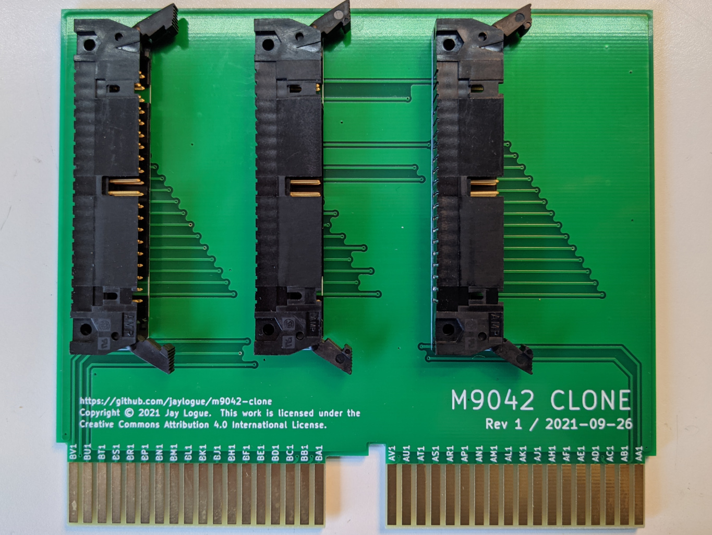

# M9042 Clone

M9042 clone is a PCB clone of the DEC M9042 Unibus module.  It provides an easy to build replacement for the original hardware, which is now hard to come by.

The original M9042 is a Unibus extension card for use in DEC PDP and Vax computers.  The M9042 makes it possible to extend a single Unibus bus across multiple chassis.  M9042s are used in pairs, one in each chassis, and connected via a set of three 40-pin ribbon cables (referred to as H854 cables).  The M9042 itself a short-form, dual height Unibus card which is designed to plug into the A and B connectors in a standard Unibus in/out slot.

The M9042 clone board is a straightforward redesign of the original M9042.  It has the same form-factor as the original and carries all the same Unibus signals and ground lines, in their same connector positions.  It also has a similar (although not identical) trace layout, with significant ground plane coverage, like the original.

* [M9042 clone schematic](docs/m9042-clone-sch.pdf)
* [M9042 clone PCB](docs/m9042-clone-pcb.pdf)

Documentation for the original M9042 (really just the board layout) can be found in the DW720 Field Maintenance Print Set, pp. 151-153 (available on [bitsavers](https://www.google.com/url?sa=t&rct=j&q=&esrc=s&source=web&cd=&cad=rja&uact=8&ved=2ahUKEwjrjoDqwcLzAhX1JTQIHfo5BsIQFnoECAIQAQ&url=http%3A%2F%2Fwww.bitsavers.org%2Fpdf%2Fdec%2Fvax%2F780%2FMP00497_DW780_Dec77.pdf&usg=AOvVaw0sKogK5xX24SyNcEcva4TK)).

The Computer History Wiki also has a useful page on the [H854 header pinout](https://gunkies.org/wiki/UNIBUS_H854_header_pinout).

## Repo Contents

The m9042-clone repo includes the following files:

* `kicad/*` – KiCad 5.x project files containing the schematic and PCB layout
* `pcb-plots/*` – Gerber and drill list files for the m9042-clone PCB
* `docs/*` – Various documentation files

## Parts List

A M9042 clone board is made up of exactly 4 parts: the PCB and three 40-pin latching ribbon cable headers. (Remember, though, that you need two M9042s to form an interconnect).  

I designed the board around the following headers.  These are intended to accommodate IDC ribbon cable connectors **without** strain reliefs.  Other choices (and sources) will likely work as well.

[TE Connectivity 5499913-9 – AMP-LATCH 40 Position Header](https://www.te.com/usa-en/product-5499913-9.html)

Three 40-pin ribbon cables are required to connect the boards together.  These are standard straight-through ribbon cables with 40-pin IDC connectors.  For ease of fitting the cables, its best if the cable exits the connector on the side with the registration tab.

## Ordering PCBs

The `pcb-plots` directory contains all the files necessary to order PCBs from a prototype PCB house such as [JLCPCB](https://jlcpcb.com/).

When ordering PCBs, be sure to request the following options:

* ENIG or hard gold surface finish
* Beveled connector edges
* Board thickness 1.4mm to 1.6mm

Board thicknesses of 1.6mm are common.  DEC specified its boards to be .056" (+/-0.005) thick, which makes 1.6mm a little big.  In practice, though, it does work.

Technically, a hard gold surface finish is best to ensure durability of the edge connectors against repeated insertions/removals.  Unfortunately it is expensive and not offered by many PCB manufactures.  ENIG is a more affordable compromise.

## M9042 Pin Numbering and Cable Orientation

One slight difference between the original M9042 and the clone is the numbering scheme used for the ribbon cable connectors.  Modern ribbon cable connectors place pin #1 in the upper right when looking into the connector pins with the registration slot facing up.  (A little arrow on the header marks the location of pin #1).  This orientation results in the red stripe on a ribbon cable being towards the right of the header when connected.

Historically, however, DEC considered the first pin (pin A) to be the one on the lower left of the connector, with numbering going in the opposite direction.  **In practice, this difference is of no consequence**, because all connections between pairs of M9042s are straight-though, and the registration tabs prevents connectors from being inserted upside-down.

Do however make sure to properly interconnect the three cables between their respective headers on each M9042 (J1-to-J1, J2-to-J2, etc.), as mixing these up would almost certainly be bad.

## WARNING

The M9042 clone has been successfully tested as an interconnect between a PDP-11/05 and an ME11-L box. _**This, however, is the extent of the testing done to date**_ (because that's all the hardware I have).

Because of this, anyone attempting to use the M9042 clone in their own equipment should proceed with caution, as I make no guarantee that it won't cause damage to your precious retro equipment.

If it does end up working for you, please drop me a line and let me know.

## License

The M9042 clone project, including the schematics, PCB layouts, all associated documentation and this README, are licensed under a [Creative Commons Attribution 4.0 International License](https://creativecommons.org/licenses/by/4.0/).  The file `LICENSE.TXT` contains a copy these provisions.
